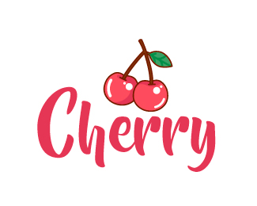

# Cherry

Dart CLI template generator and package manager for flutter, generate MVC, MVVM and MVU patterns.



### Current list of supported commands

Usage: Cherry <command> [arguments]

```zsh
Global options:
-h, --help       Print this usage information.
-v, --version

Available commands:
  create     Creates a new Cherry Picked Flutter project.
  generate   Creates a View, ViewModel, Controller, Widget or Repository according to the option.
  install    Install (or update) a new package or packages:
  start      Create a basic structure for your project (confirm that you have no data in the "lib" folder).
```
